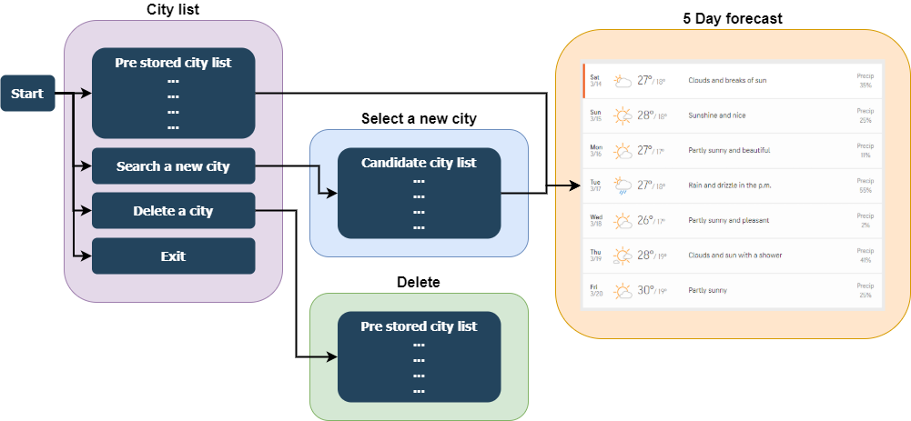

<h1 align="center"> Weather application
</h1>

# Table of Contents
* [Source link](#Source-link)
* [Purpose and scope](#Purpose-and-scope)
* [Features](#Features)
* [User interaction and experience](#User-interaction-and-experience)
* [Installation guide and requirement](#Installation-guide-and-requirement)
<br /><br /><br />

# Source link
Source code is in https://github.com/jasonkim7288/weather_terminal_app<br /><br />

[Go back](#table-of-contents)<br /><br /><br />

# Purpose and scope
Weather application will show you the weather information based on the region you input. Accuweather API is used for getting GPS coordinates and get the weather information<br />

[Go back](#table-of-contents)<br /><br /><br />

# Features
## City name search
Once the user input the city name, candidate cities which have the same name but locate in the different country or state can be listed by using AccuWeather REST Api. Each city information has it's own city id and GPS coordinates.

## Weather prediction
Once getting the city information, you can see the 5 DAY FORECAST of the city by using AccuWeather REST Api.

[Go back](#table-of-contents)<br /><br /><br />

# User interaction and experience
When started, navigate the menu as below



[Go back](#table-of-contents)<br /><br /><br />

# Installation guide and requirement
## Get started
* This installation guide is for Mac users
1. Visit https://developer.accuweather.com/getting-started, and follow all the procedure.

2. If you don't have Ruby installed, you can download it and follow the installation instructions available [here](https://www.ruby-lang.org/en/documentation/installation/).

3. If you don't have bunlder gem, run as below
```
gem install bundler
```

4. Overwrite your API key of AccuWeather to 'weather_terminal_app/res/accuweather_key.db'.
Only <strong>One key</strong> should be inside of this file

5. Change your working directory to the project source directory
```
[~]$ cd ~/weather_terminal_app/src
```

6. Run the script for Weather terminal application
```
[~/weather_terminal_app/src]$ ./run_accuweather.sh
```


## Dependencies
### Gems required
- rest-client
- singleton
- json
- pp
- mac-say
- colorize
- tty-prompt
- tty-table
- tty-font

[Go back](#table-of-contents)<br /><br /><br />